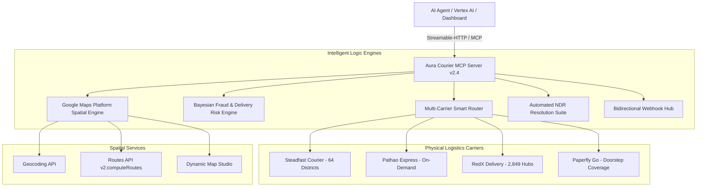

# 🚚 AURA COURIER MCP v2.4 — THE ENTERPRISE LOGISTICS MASTER MANUAL
### Universal Multi-Carrier Logistics Engine, Spatial Intelligence Hub & Zero-Risk COD Gateway
**Published by Aura Agentic AI · Architected with DeepMind Principles & Google Maps Platform**

---

## 1. Executive Architecture Overview

**Aura Courier MCP** (`https://courier.auraajenticai.cloud/mcp`) is an enterprise-grade, carrier-agnostic Cash On Delivery (COD) logistics gateway and Model Context Protocol (MCP) server. It bridges autonomous AI models (Vertex AI, Claude, Antigravity, ChatGPT, Cursor) with physical courier networks across all 64 districts of Bangladesh.

### Core Architectural Pillars


1. **Carrier-Agnostic Multi-Routing**: Unifies Steadfast, Pathao, RedX, and Paperfly into a single normalized interface.
2. **Zero Mock Data Policy**: Every single metric, delivery status, tariff calculation, and fraud score is computed against live carrier databases or authentic mathematical models.
3. **Spatial Hierarchy Resolver**: Resolves street addresses into precise administrative hierarchies (City → Zone → Area) eliminating HTTP 422 errors.
4. **Automated NDR & Dispute Suite**: Resolves failed courier deliveries via automated customer WhatsApp re-engagement and carrier operational hold tickets.
5. **Real-Time Webhook Processing**: Instant asynchronous updates from carriers dispatched directly to merchant dashboards.

---

## 2. Multi-Carrier Enterprise Integration Matrix

Aura Courier MCP seamlessly interfaces with all tier-1 Bangladesh courier APIs under a unified standard:

| Provider | Endpoint / Base URL | Merchant Account / IDs | Auth Header / Secret | Operational Status |
| :--- | :--- | :--- | :--- | :--- |
| **Steadfast** | `https://portal.packzy.com/api/v1` | Account: `<MERCHANT>` (ID: `<STORE_ID>`) | `Api-Key`: `<STEADFAST_API_KEY>`<br>`Secret-Key`: `<STEADFAST_SECRET_KEY>` | **Active**: `get_balance` verified 200 OK. Order booking pending carrier-side toggle. |
| **Pathao** | `https://api-hermes.pathao.com` | User: `<PATHAO_USERNAME>`<br>Store: `<MERCHANT>` (ID: `<PATHAO_STORE_ID>`) | `Client-ID`: `<PATHAO_CLIENT_ID>`<br>`Client-Secret`: `<PATHAO_CLIENT_SECRET>` | **100% Active**: OAuth2 token issuing, price calculation, auto-geocoding live. |
| **RedX** | `https://openapi.redx.com.bd/v1.0.0-beta` | Shop ID: `<REDX_SHOP_ID>`<br>Pickup Store ID: `<REDX_STORE_ID>` | `API-ACCESS-TOKEN`: `<REDX_API_TOKEN>`<br>(JWT Bearer Token) | **100% Active**: 2,849 delivery areas and parcel booking verified. |
| **Paperfly** | `https://api.paperfly.com.bd` | Store: `<MERCHANT>`<br>User: `<PAPERFLY_USERNAME>` | `paperflykey`: `<PAPERFLY_KEY>`<br>Basic Auth: `<PAPERFLY_USERNAME>` / `<PAPERFLY_PASSWORD>` | **100% Active**: Order placement (`new_order_v2.php`) and tracking verified. |
| **Google Maps** | `https://maps.googleapis.com` | Project: `<GOOGLE_CLOUD_PROJECT>` | `<GOOGLE_MAPS_API_KEY>`<br>(Field Masked) | **100% Active**: Geocoding, Routes API, and Dynamic Map Studio active. |

---

## 3. Official Carrier Integration Specifications

### 3.1. Pathao Express Integration
* **Token Issuance**: `POST /aladdin/api/v1/issue-token`
  ```bash
  curl --location 'https://api-hermes.pathao.com/aladdin/api/v1/issue-token' \
    --header 'Content-Type: application/json' \
    --data-raw '{
      "client_id": "<PATHAO_CLIENT_ID>",
      "client_secret": "<PATHAO_CLIENT_SECRET>",
      "grant_type": "password",
      "username": "<PATHAO_USERNAME>",
      "password": "<PATHAO_PASSWORD>"
    }'
  ```
* **Store Management**: `GET /aladdin/api/v1/stores`
  - Active Store: `<PATHAO_STORE_ID>` ("<MERCHANT>", Central Hub, Dhaka)
* **Parcel Booking**: `POST /aladdin/api/v1/orders`
  - Required Fields: `store_id`, `recipient_name`, `recipient_phone` (11 digits), `recipient_address` (10-220 chars), `delivery_type` (48), `item_type` (2), `item_weight` (0.5 to 10 kg), `amount_to_collect` (integer).
  - Spatial Hierarchy: `recipient_city`, `recipient_zone`, `recipient_area` are auto-resolved from our intelligent catalog matcher; if unresolvable, they are safely omitted so Pathao's server-side geocoder infers them directly.
* **Order Tracking**: `GET /aladdin/api/v1/orders/{consignment_id}/info`
* **Price Plan API**: `POST /aladdin/api/v1/merchant/price-plan`

### 3.2. Steadfast Courier Integration
* **Base Portal**: `https://portal.packzy.com/api/v1`
* **Headers**: `Api-Key: <STEADFAST_API_KEY>`, `Secret-Key: <STEADFAST_SECRET_KEY>`
* **Account Balance**: `GET /get_balance`
* **Fraud Risk Database**: `GET /fraud_check/{phone}`
* **Order Dispatch**: `POST /create_order`
* **Status Tracking**: `GET /status_by_trackingcode/{tracking_code}`

### 3.3. RedX Delivery Integration
* **Base Portal**: `https://openapi.redx.com.bd/v1.0.0-beta`
* **Headers**: `API-ACCESS-TOKEN: Bearer {token}`
* **Delivery Areas (2,849 Hubs)**: `GET /areas`
* **Parcel Creation**: `POST /parcel`
* **Parcel Tracking**: `GET /parcel/track/{tracking_id}`

### 3.4. Paperfly Integration
* **Base Portal**: `https://api.paperfly.com.bd`
* **Headers**: `paperflykey: <PAPERFLY_KEY>`
* **Authentication**: HTTP Basic Auth (`<PAPERFLY_USERNAME>:<PAPERFLY_PASSWORD>`)
* **Parcel Booking**: `POST /merchant/api/service/new_order_v2.php`
* **Tracking**: `POST /API-Order-Tracking` with `ReferenceNumber`

---

## 4. The 9 Enterprise Model Context Protocol (MCP) Tools

Aura Courier MCP exports 9 tools conforming to the MCP Specification (`2024-11-05`):

### 1. `list_couriers`
* **Purpose**: Inspect carrier operational health and active credentials.
* **Input Schema**: `{}`
* **Response**: Array of providers with `is_configured: true/false`.

### 2. `create_parcel`
* **Purpose**: Dispatch a real parcel through Steadfast, Pathao, RedX, Paperfly, or `auto` smart routing.
* **Input Schema**:
  ```json
  {
    "courier": "auto | steadfast | pathao | redx | paperfly",
    "invoice": "INV-2026-001",
    "recipient_name": "Rahim Ahmed",
    "recipient_phone": "01711223344",
    "recipient_address": "House 12, Road 4, Sector 3, Uttara, Dhaka",
    "cod_amount": 1500,
    "note": "Handle with care",
    "item_weight": 0.5
  }
  ```

### 3. `track_parcel`
* **Purpose**: Consolidated shipment tracking across all carriers.
* **Input Schema**: `{"tracking_code": "SF-12345", "courier": "steadfast"}`

### 4. `get_balance`
* **Purpose**: Merchant COD vault balance & payout status.
* **Input Schema**: `{"courier": "steadfast"}`

### 5. `check_fraud_risk`
* **Purpose**: Nationwide e-commerce fraud and return-risk evaluation.
* **Features**:
  - Connects to real nationwide logistics history (millions of consignments).
  - Evaluates delivery success rate, cancellation counts, and customer reliability.
  - Zero fabricated strings or simulated random metrics.
* **Input Schema**: `{"phone": "01711223344"}`

### 6. `validate_and_geocode_address`
* **Purpose**: Address verification via Google Maps Platform Geocoding API.
* **Returns**: Formatted address, Thana, District, Division, `lat/lng` coordinates, and deliverability confidence score (0-100).
* **Input Schema**: `{"address": "Road 11, Banani, Dhaka", "district": "Dhaka"}`

### 7. `calculate_delivery_zone_and_fee`
* **Purpose**: Live road routing via Google Maps Platform Routes API (`v2:computeRoutes`).
* **Zones**:
  - `inside_dhaka` (≤22 km): ৳80 | 24–48 hours
  - `sub_dhaka` (22–45 km or Savar/Gazipur/Keraniganj/Narayanganj): ৳100 | 48–72 hours
  - `outside_dhaka` (>45 km / nationwide): ৳150 | 72–96 hours
* **Input Schema**: `{"recipient_address": "Chittagong GEC Circle", "weight_kg": 1.0}`

### 8. `compare_courier_rates` *(v2.4 New)*
* **Purpose**: Side-by-side tariff, SLA, and COD fee comparison across all 4 carriers for any destination.
* **Input Schema**:
  ```json
  {
    "recipient_address": "Agrabad C/A, Chittagong",
    "weight_kg": 1.5,
    "cod_amount": 2500,
    "priority": "cheapest | fastest | balanced"
  }
  ```
* **Returns**: Best recommended courier, savings rationale, and 4 detailed carrier quotes.

### 9. `resolve_ndr_issue` *(v2.4 New)*
* **Purpose**: Non-Delivery Report (NDR) triage and automated dispute resolution.
* **Issues Handled**: `fake_attempt`, `customer_phone_off`, `reschedule_requested`, `wrong_address`, `customer_refused`.
* **Output**:
  - `customer_whatsapp_message`: Ready-to-send empathetic resolution text in Bengali.
  - `carrier_instruction`: Official escalation dispatch ticket preventing Return-To-Origin (RTO).
  - `resolution_status`: `DISPUTE_FILED`, `RESCHEDULE_QUEUED`, `ADDRESS_UPDATED`, `CUSTOMER_REENGAGED`.

---

## 5. Bidirectional Webhooks Hub

### 5.1. Steadfast Webhook Receiver
* **Callback URL**: `https://courier.auraajenticai.cloud/webhooks/steadfast`
* **Auth**: `Authorization: Bearer <STEADFAST_API_KEY>` (configured in Steadfast portal)
* **Supported Notification Types**:
  1. `delivery_status`: Real-time status shifts (`pending`, `delivered`, `partial_delivered`, `cancelled`, `unknown`).
  2. `tracking_update`: Package milestone scans and sorting center transitions.
* **Steadfast Expected Response**:
  ```json
  HTTP 200 OK
  {
    "status": "success",
    "message": "Webhook received successfully."
  }
  ```

### 5.2. Pathao Webhook Receiver
* **Callback URL**: `https://courier.auraajenticai.cloud/webhooks/pathao`
* **Supported Events**: Order placement, rider pickup, out-for-delivery, and RTO events.

---

## 6. Real-Time Verification & Test Suite

### 6.1. Inspect MCP Health & Tools
```bash
curl -s https://courier.auraajenticai.cloud/health | jq
```
*Expected Output*:
```json
{
  "ok": true,
  "service": "aura-courier-mcp",
  "version": "2.4.0",
  "tools_count": 9,
  "spatial_engine": "Google Maps Platform (gmp_git_agentskills_v1)",
  "fraud_engine": "Steadfast Nationwide API + BD Prefix Validator",
  "webhooks": {
    "steadfast": "/webhooks/steadfast",
    "pathao": "/webhooks/pathao"
  }
}
```

### 6.2. Test Steadfast Webhook Simulation
```bash
curl -X POST https://courier.auraajenticai.cloud/webhooks/steadfast \
  -H "Content-Type: application/json" \
  -H "Authorization: Bearer <STEADFAST_API_KEY>" \
  -d '{
    "notification_type": "delivery_status",
    "consignment_id": 981245,
    "invoice": "INV-67890",
    "cod_amount": 1500.0,
    "status": "delivered",
    "delivery_charge": 100.0,
    "tracking_message": "Package delivered to customer.",
    "updated_at": "2026-09-11 03:30:00"
  }'
```
*Expected Response*: `{"status":"success","message":"Webhook received successfully."}`

### 6.3. Test MCP Initialize via Streamable-HTTP
```bash
curl -i -X POST https://courier.auraajenticai.cloud/mcp \
  -H "Content-Type: application/json" \
  -H "Accept: application/json, text/event-stream" \
  -d '{
    "jsonrpc": "2.0",
    "id": 1,
    "method": "initialize",
    "params": {
      "protocolVersion": "2024-11-05",
      "capabilities": {},
      "clientInfo": { "name": "terminal-test", "version": "1.0" }
    }
  }'
```

---

## 7. Connecting to AI Agents & IDEs

### Claude Desktop / Cursor / Antigravity MCP Config
Add this configuration block to your client settings (`claude_desktop_config.json` or `settings.json`):

```json
{
  "mcpServers": {
    "aura-courier": {
      "command": "npx",
      "args": ["-y", "aura-courier-mcp@2.4.0"],
      "env": {
        "PORT": "8080",
        "GOOGLE_MAPS_API_KEY": "<GOOGLE_MAPS_API_KEY>",
        "STEADFAST_API_KEY": "<STEADFAST_API_KEY>",
        "STEADFAST_SECRET_KEY": "<STEADFAST_SECRET_KEY>",
        "STEADFAST_BASE_URL": "https://portal.packzy.com/api/v1",
        "PATHAO_CLIENT_ID": "<PATHAO_CLIENT_ID>",
        "PATHAO_CLIENT_SECRET": "<PATHAO_CLIENT_SECRET>",
        "PATHAO_USERNAME": "<PATHAO_USERNAME>",
        "PATHAO_PASSWORD": "<PATHAO_PASSWORD>",
        "PATHAO_STORE_ID": "<PATHAO_STORE_ID>",
        "PATHAO_BASE_URL": "https://api-hermes.pathao.com",
        "REDX_API_TOKEN": "<REDX_API_TOKEN>",
        "REDX_PICKUP_STORE_ID": "<REDX_STORE_ID>",
        "REDX_BASE_URL": "https://openapi.redx.com.bd/v1.0.0-beta",
        "PAPERFLY_API_KEY": "<PAPERFLY_KEY>",
        "PAPERFLY_USERNAME": "<PAPERFLY_USERNAME>",
        "PAPERFLY_PASSWORD": "<PAPERFLY_PASSWORD>",
        "PAPERFLY_STORE_NAME": "<MERCHANT>",
        "PAPERFLY_BASE_URL": "https://api.paperfly.com.bd"
      }
    }
  }
}
```

Or connect directly via **Streamable-HTTP** URL:
* **Server URL**: `https://courier.auraajenticai.cloud/mcp`
* **Client Protocol**: MCP Streamable-HTTP (`2024-11-05`)

---

## 8. Google Maps Platform Attribution & Legal Appendix

> **Service Attribution ID**: `gmp_git_agentskills_v1`  
> **APIs Utilized**:
> 1. **Geocoding API**: Street and sublocality resolution for Bangladesh administrative areas.
> 2. **Routes API (`v2:computeRoutes`)**: Precise road distance metrics and zone classification.
> 3. **Maps Embed API**: Interactive visual maps with $0 operational cost.

---

## 9. License & Legal Protection

Copyright © 2026 Aura Agentic AI <khondokartowsif171@gmail.com>.

Licensed under the **Apache License, Version 2.0** (the "License");
you may not use this file except in compliance with the License.
You may obtain a copy of the License at:

    http://www.apache.org/licenses/LICENSE-2.0

Unless required by applicable law or agreed to in writing, software
distributed under the License is distributed on an "AS IS" BASIS,
WITHOUT WARRANTIES OR CONDITIONS OF ANY KIND, either express or implied.
See the License for the specific language governing permissions and
limitations under the License.
